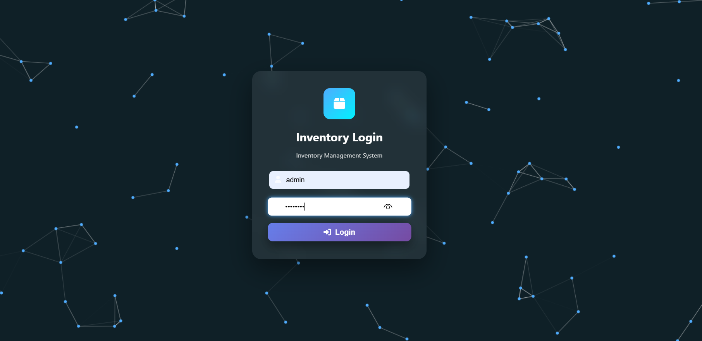
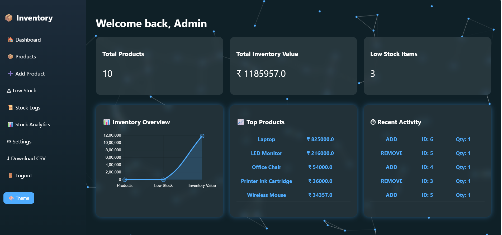
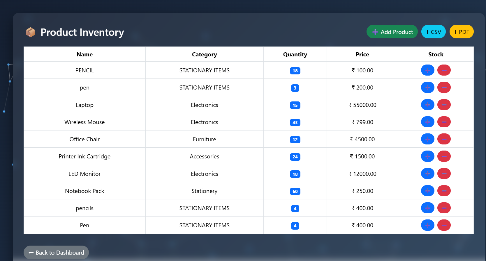
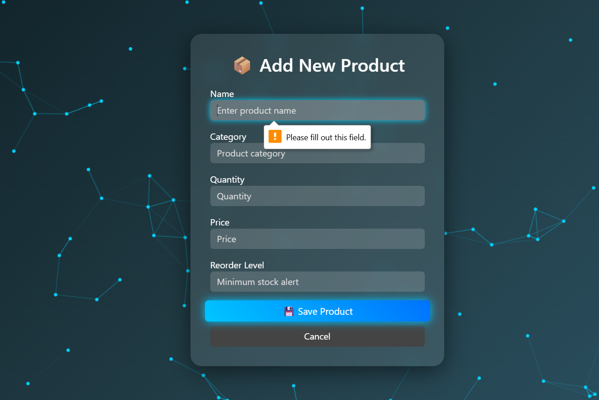
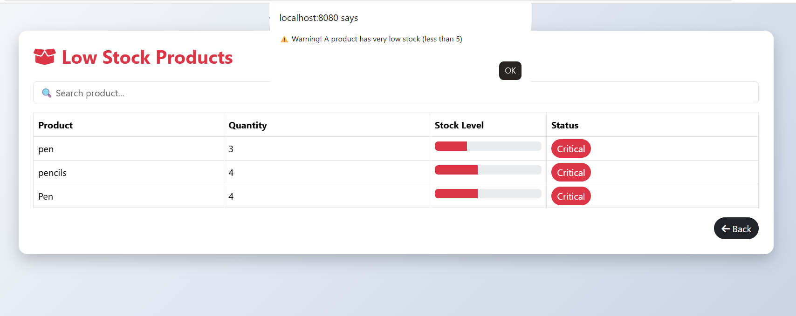
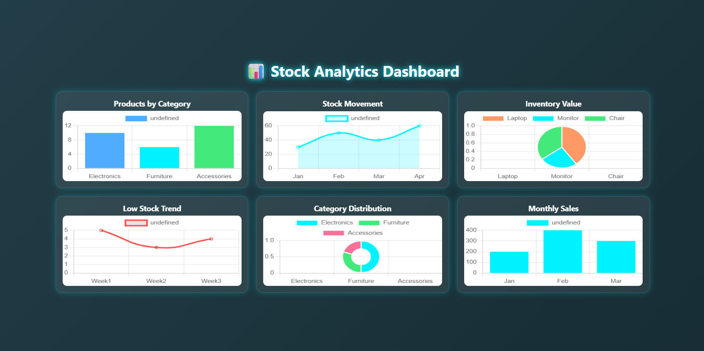
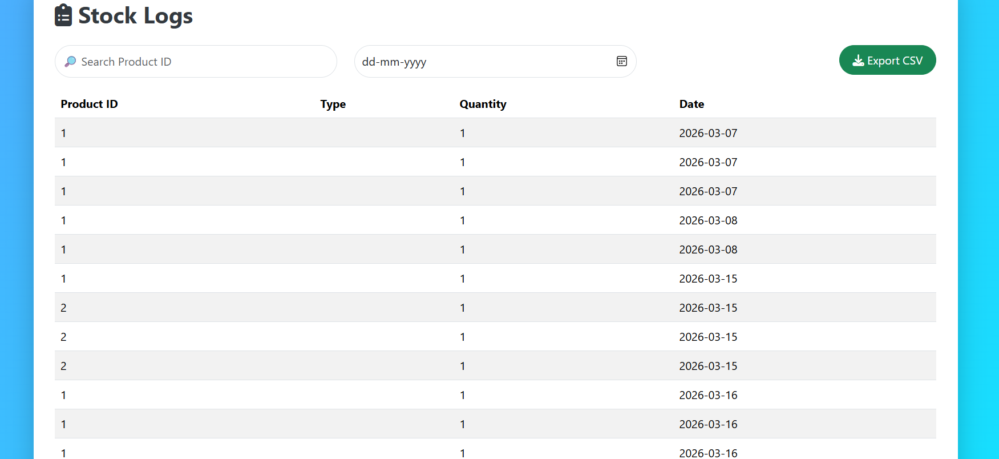
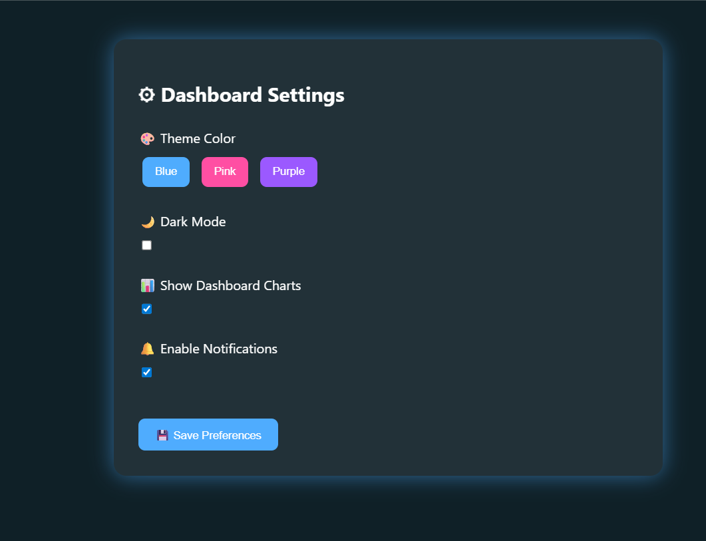

# Inventory Monitoring and Report System

A **Java Spring Boot based Inventory Management System** that helps businesses manage products, monitor stock levels, track inventory changes, and generate reports efficiently.

This system provides **role-based access control**, **low stock alerts**, **dashboard analytics**, and **exportable reports** in **CSV and PDF formats**.


# 🚀 Features

* Secure Login Authentication
* Role-Based Access (Admin / User)
* Product Management (Add / Update / View Products)
* Stock Update Tracking
* Low Stock Detection
* Inventory Dashboard Analytics
* Stock Change Logs
* Export Reports (CSV / PDF)
* Automated Email Alerts for Low Stock


# 🛠️ Technology Stack

### Backend

* Java
* Spring Boot
* Spring Security
* Spring Data JPA

### Frontend

* Thymeleaf
* HTML
* CSS
* Bootstrap

### Database

* MySQL

### Tools

* Maven
* Git & GitHub
* IntelliJ IDEA
* iText PDF
* OpenCSV

---

# 📂 Project Structure

src
└── main
    ├── java
    │   └── com.enterprise.inventory
    │       ├── config
    │       ├── controller
    │       ├── entity
    │       ├── repository
    │       ├── security
    │       └── service
    │
    └── resources
        ├── templates
        └── application.properties
```

---

# 🔐 Default Login Credentials

### Admin Login

Username: admin
Password: admin123

### User Login

Username: user1
Password: admin123


 📊 System Modules

1️⃣ Authentication Module

Provides secure login using **Spring Security**.

 2️⃣ Product Management Module

Allows adding, updating, and managing inventory products.

 3️⃣ Inventory Tracking Module

Tracks stock updates and monitors product quantity levels.

 4️⃣ Dashboard Analytics

Displays inventory statistics and product insights.

 5️⃣ Stock Log System

Maintains history of inventory updates.

 6️⃣ Reporting Module

Generates reports in **CSV and PDF format**.

 7️⃣ Email Notification System

Automatically sends alerts when stock quantity falls below the reorder level.

## 📸 Project Screenshots

### 🔐 Login Page


### 📊 Dashboard


### 📦 Products Page


### ➕ Add Product


### ⚠️ Low Stock Monitoring


### 📈 Visualization / Analytics


### 📝 Stock Logs


### ⚙️ Settings


 ⚙️ How to Run the Project

 1️⃣ Clone the repository

git clone https://github.com/ponkarthika96/inventory-monitoring-report-system.git


 2️⃣ Open in IntelliJ IDEA

Open the project using **IntelliJ IDEA**.

 3️⃣ Configure Database

Edit `application.properties`


spring.datasource.url=jdbc:mysql://localhost:3306/inventory_db
spring.datasource.username=root
spring.datasource.password=yourpassword


 4️⃣ Run the Application

Run the Spring Boot application:

```
InventoryApplication.java
```

5️⃣ Open Browser

```
http://localhost:8080/login
```

---

👩‍💻 Author

**Ponkarthika**

GitHub: https://github.com/ponkarthika96

👥 Contributors

Team members who contributed and supported:

- Prasanna Venkatesh V
- Prasanna S
- Vihashini R

---

 📜 License

This project is licensed under the **MIT License**.
